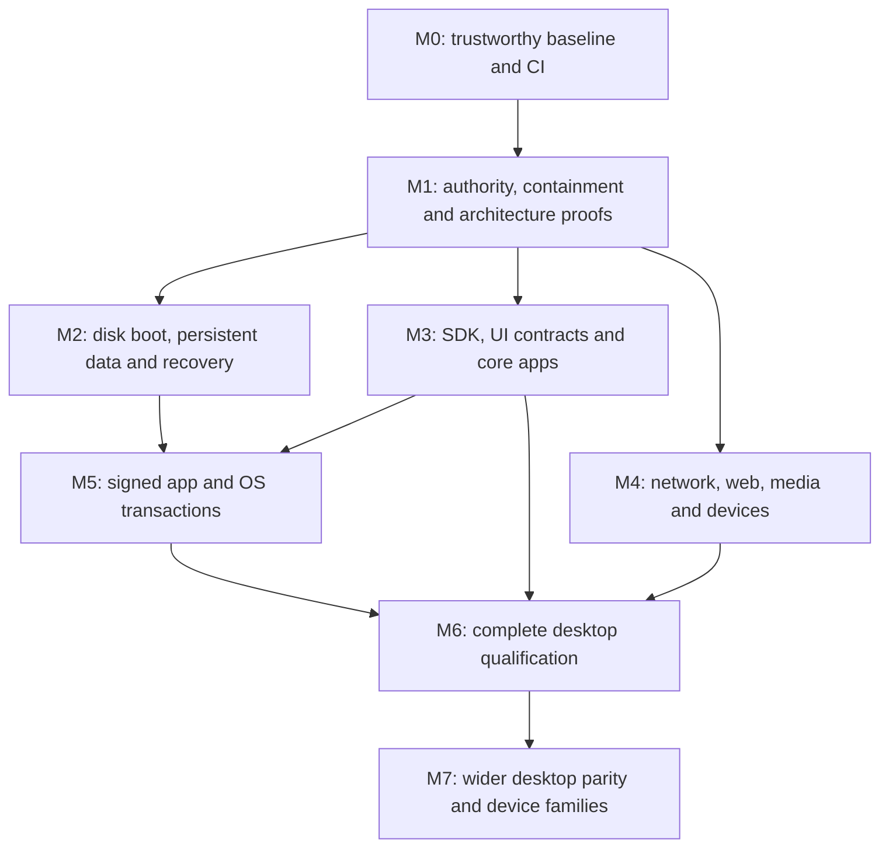

# VyomaOS complete OS roadmap — long-term graphical desktop

Date: 2026-09-29. Status: **proposed execution baseline**, grounded in local commit `418359d3`.

**Release-scope update:** the first release is now **R1: terminal-first desktop**. [Root TODOS.md](../TODOS.md) is the execution checklist and takes precedence for R1 scope, dependencies and acceptance. This document retains the broader graphical desktop and later-device vision (R2+); browser, compositor and media completion are not R1 blockers. [Codex work-loop proposal](codex-work-loop.md) describes sustained implementation, without activating a background job.

Companion: [readiness review and evidence](reviews/2026-09-29-complete-os-review.md). Earlier plans remain design/history references. This proposal does not mark any implementation milestone complete.

## 1. Outcome and graphical desktop release (after R1)

Build a complete, maintainable operating system whose application platform is capability-secured WebAssembly. Continue to use Linux for drivers, memory, scheduling and hardware support; build Vyoma's user experience and service contracts above it. A new kernel is not required by the existing vision.

Use the existing master spec's **desktop → mobile → embedded** direction as the planning assumption. First prove one x86-64 desktop hardware configuration plus a QEMU reference machine. Server/edge can reuse the secured Linux foundation after the desktop architecture is stable. Broader desktop parity, mobile and constrained MCU systems remain separate deliverables, not implicit properties of a TOML profile.

The complete graphical desktop release after terminal-first R1 must let a user:

1. Install on a supported PC from bootable media, create credentials, and boot without a development host.
2. Log in, lock/unlock, shut down and recover safely; preserve documents, settings and app installations across reboot.
3. Connect to supported networks, resolve names, validate HTTPS, and use the required browser/web workflows.
4. Find/open/edit/save documents, use clipboard and file dialogs, manage windows, and navigate the core UI using keyboard and pointer.
5. Use the core UI at supported scales with Unicode, an accessible semantic tree, and a working screen-reader path.
6. Play supported audio/video, open images/PDFs and use the declared hardware features with actual backends.
7. Install, update and remove trusted app bundles; update the OS, survive an interrupted update, roll back and restore backups.
8. Run an untrusted app without giving it other apps' files, secrets, administrative privileges, or unbounded resources.
9. Develop and debug a third-party WASM app using a versioned SDK, independently of the OS repository.

These outcomes define a complete **bounded desktop product**, not Windows/macOS compatibility or all-hardware parity. Do not call a narrower research preview a daily-use release. Maintain later parity/device work in the coverage map rather than silently deleting it.

Team size and delivery horizon are unspecified. Sequence by gates; estimate dates only after M0 and the M1 browser/runtime feasibility experiments. No calendar promises are implied below.

## 2. Readiness and release ledger

Track each feature with separate fields: design status, implementation status, integration status, validation status, supported targets, owner, source paths, tests, known limitations, milestone and blocking dependencies. Use `unknown`, `planned`, `implemented`, `integrated`, and `accepted` explicitly. `accepted` requires passing evidence for the declared target and user workflow.

Keep design debates and historical phase checkmarks unchanged as history. Link them from the new ledger; never import their `completed` value as implementation readiness. The [80-subsystem mapping](reviews/2026-09-29-subsystem-matrix.csv) supplies initial milestone allocation, not certification. The [app inventory](reviews/2026-09-29-app-inventory.csv) supplies the initial app audit queue.

Require an owner to attach command, commit, artifact digest, runtime/tool versions and result to every acceptance record. Make public documentation derive from accepted entries. A mock, a screenshot or a file's existence is insufficient evidence for a service claim.

## 3. Architectural decisions to settle before broad expansion

| Decision | Proposed direction | Evidence required before adoption |
|---|---|---|
| Runtime/process topology | Keep PID 1 small; trial a per-app worker embedding Wasmtime and exposing typed imports; retain the CLI launcher as a migration backend | Trap, worker crash, OOM, stuck host call, restart, idle RSS, cold/warm launch and 10-app latency measurements |
| App identity and authority | Stable signed bundle identity + distinct instance ID + user/session identity; effective grants are the intersection of requested and approved policy | No caller-supplied identity spoofing; revoked/stale handles fail; identical checks on legacy and typed routes |
| App ABI and IPC | Versioned WIT/component interfaces for lifecycle, files, network, UI and media; bounded legacy protocol adapter during migration | Existing apps run through the adapter; new SDK sample uses real typed calls; ABI mismatch gives an actionable failure |
| Native trusted services | Explicit, small trusted services may implement hardware/media/web backends; user apps remain WASM | ADR inventories privileges, attack surface, update ownership, dependencies and cross-process policy; this is a proposed choice, not a silent relaxation of the vision |
| Graphics | Stabilize the existing software compositor/DRM path; benchmark before selecting a GPU/backend migration | Correct clipping/focus/resize/scaling first; memory and frame-time traces; prototype the buffer ownership protocol |
| Shared buffers | Specify ownership, lengths, lifetime, cancellation and synchronization across the runtime boundary | Working component-model prototype; memfd availability alone is not proof of safe WASM linear-memory sharing |
| Persistent storage | Protected OS state, private app containers, user documents granted through a broker; stable disk identifiers and transactional writes | Reboot/power-cut/disk-full tests and adversarial path/symlink tests |
| Update ownership | One app transaction service; one distinct OS slot/boot transaction service | Real activation, cancellation, retry, rollback, key rotation and data-schema compatibility |
| Browser/web compatibility | Early feasibility project with an explicit workload list and candidate engine integration | Actual JS/forms/downloads/uploads/TLS/accessibility workload results, memory/performance and maintainability; if a strict all-WASM engine is infeasible, document the product choice before planning a daily-use release |
| Platform expansion | Hardware/kernel/runtime/component compatibility matrix per target | Boot and real workload evidence on each target; portable APIs may require different artifacts for constrained devices |

The master spec contains useful proposals but is internally inconsistent about embedded execution, global locking, typed callbacks, stdin loops and buffer sharing. Resolve those with short architecture decision records (ADRs) and experiments. Benchmark concurrency changes before adopting sharded tables, lock-free structures or a new compositor.

Reuse maintained implementations for cryptography, TLS, text shaping, codecs, device stacks and browser engines where the architecture permits. Minimize the trusted surface, not dependency count at any cost. Document versions, licenses, patch ownership and trust boundaries. WASM applications can be portable while the kernel, runtime, drivers, compiled cache and selected features remain target-specific.

## 4. Dependency order

Hardware probes and browser/runtime feasibility begin in M1 to expose major risks early. M2, M3 and M4 can have separate owners after shared contracts stabilize. A small team should complete one vertical workflow at a time; multiple active workstreams are a staffing option, not a requirement.

### M0 — Establish a trustworthy baseline

Deliver:

- Pin the Rust toolchain, supported kernel baseline, runtime, container inputs and dependency lockfiles; move workspace release settings to the workspace root.
- Fix the verified CLI Clap-feature error and supervisor warning gate. Remove stale build instructions.
- Make clean CI build the kernel, selected apps, supervisor and rootfs before smoke; verify selected app artifacts are present.
- Fix stale kernel reuse, config propagation, profile naming/unsupported target handling, profile-test exit status and E2E working-directory/skip behavior.
- Add a release app allowlist and separate showcase/demo catalog. Preserve the 208 apps; classify rather than delete them.
- Establish real-service test harnesses with injectable state directories and deterministic app fixtures. Capture boot logs and QEMU stderr.
- Populate the feature ledger and measure current boot, idle memory, launch latency, frame time and artifact size on specified VM settings.

Acceptance: a fresh checkout in the documented builder produces a bootable image without prior `out/` files; required tests run instead of skip; any missing kernel/app or failed profile test fails CI. The CLI compiles and performs `ps` against the actual VM. Record baseline measurements without claiming existing README performance numbers are verified.

### M1 — Establish authority and contain failures

Deliver:

- Define the threat model: malicious guest, compromised package mirror, untrusted network peer, lost/stolen disk, crashed service and interrupted update. Document excluded physical/firmware threats explicitly.
- Introduce app/instance/session identities and a central policy check before every privileged operation. Preserve authenticated sender information across IPC.
- Enforce per-app storage, file-dialog grants, network destination policy, secret access, clipboard/capture consent and separate system-administration privileges. Revoke grants on logout/uninstall.
- Disable unauthenticated management in release mode; implement bounded, authenticated developer access and request IDs/cancellation.
- Remove default credentials and insecure encryption from the release path; replace with reviewed secret storage and password hashing; redact logs before persistence.
- Bound queues, input lines, logs, surfaces, upload sizes, open files and worker concurrency. Apply per-app memory/CPU/process limits and restart backoff.
- Prototype the runtime worker, typed interfaces, browser integration and selected PC boot/device support. Preserve PID 1 survival and independent service restartability.

Acceptance: real WASM fixtures fail to access another app's data, make denied direct/brokered connections, alter system policy, inject privileged input or escape document grants. Flooding/stalled/crashing guests are contained; the desktop and a second app remain usable. Unauthenticated management requests fail. Logs contain no fixture secrets. The architecture ADRs include measured tradeoffs, including browser feasibility.

This gate is required before presenting third-party app execution or secret handling as secure. [Wasmtime sandbox boundaries](https://docs.wasmtime.dev/security.html) and [resource-limit configuration](https://docs.wasmtime.dev/api/wasmtime/struct.Config.html) inform the implementation, but do not replace application-level authorization.

### M2 — Make the OS independently bootable and persistent

Deliver:

- Specify a disk layout with EFI boot partition, OS/recovery images and durable user/system state; reserve update-slot capacity from the start.
- Boot a disposable QEMU disk through UEFI; implement installer preflight, target confirmation, partitioning, filesystem creation, bootloader installation, account enrollment and completion verification.
- Mount persistent state by UUID/label; distinguish installed, live and recovery modes. Remove dependence on a host 9P share for installed operation.
- Implement durable document/settings writes, quota/disk-full reporting, fsck/recovery flow and removable-storage permissions. Keep OS state inaccessible to ordinary apps.
- Implement backup/restore with integrity checks and documented credential/encryption recovery. Integrate shutdown/sync and boot failure detection.

Acceptance: install to an empty disposable disk; remove installation media/host shares; boot, save a document and settings, reboot and recover byte-identical contents. Interrupt saves and boots at defined points; recover without silently treating volatile storage as durable. Restore a backup to a second disk and open the documents. Test destructive installer behavior only on disposable test disks until a separate hardware test is explicitly arranged.

### M3 — Establish a usable application platform

Deliver:

- A versioned `vyoma-sdk` and shared UI library with event loop, layout, drawing, timers, dialogs, error handling and permission requests. Include compatibility negotiation and sample packaging.
- A tested window model: multiple windows/instances where supported, focus, close/save prompts, drag/resize, minimize/maximize, keyboard shortcuts, pointer routing and window restoration.
- Semantic accessibility roles/actions, keyboard focus order, screen-reader integration, text editing/selection, clipboard MIME types, Unicode shaping, IME/composition and scaling. Build these into SDK controls before migrating all apps.
- Migrate the core desktop shell, file manager, text editor, settings, activity monitor and package UI. Choose one supported implementation where variants overlap (`finder`/`file-manager`, terminal variants, settings variants).
- Real file open/save dialogs, undo and atomic document saves, recent documents, launch associations, settings persistence and per-user sessions.
- Repair the CLI and provide create/build/run/debug/log workflows usable from a separate sample repository.

Acceptance: keyboard and pointer users can open a document from the file manager, edit, copy/paste, save, close/reopen, resize and change scale without loss or wrong focus. Exercise a non-Latin composition sequence and screen-reader navigation. Crash/restart an app while another is editing. An independent developer builds, packages and debugs a sample through the documented SDK.

### M4 — Deliver actual network, web, media and device capabilities

Deliver:

- Real network interface setup, address acquisition, DNS, trusted time, TLS certificate validation, proxy/offline/error handling and reconnect behavior. Add Wi-Fi/credential handling if included in the supported desktop configuration.
- Browser integration chosen by the M1 experiment, including web engine lifecycle, permissions, origin/profile data isolation, downloads/uploads, certificate errors and engine security updates.
- Audio device output/input, mixing/volume and device selection; video playback, image decoding and PDF viewing through maintained backends. Place complex parsers outside PID 1 where practical.
- USB keyboard/mouse/storage, display modes and the selected PC's storage/network/audio drivers and firmware. Test hotplug and enumeration failures.
- Power button/shutdown/thermal behavior; require suspend/resume, battery and Wi-Fi for any laptop support claim. Multi-monitor and GPU acceleration have separate measured acceptance cases.

Acceptance: finish the declared real web tasks on the target machine, including JavaScript/forms and file transfers; play a supported media fixture with actual audible output and synchronized video; view representative PDFs/images; disconnect/reconnect network and devices without losing documents or locking the desktop. Wrong TLS certificates fail. Unsupported formats/devices produce clear errors. Record engine/dependency versions and update ownership.

The M1 browser experiment must determine feasibility early. If required web workloads cannot be delivered, release a clearly scoped developer preview while continuing this milestone; do not relabel a text-fetcher as a complete browser.

### M5 — Make distribution and updates trustworthy

Deliver:

- A signed bundle format covering content digests, identity, ABI requirements, version and capability manifest; protected trust roots, revocation and key rotation.
- Transactional app install/update/remove with staging, validation, policy approval, activation, health check, state migration and rollback. Consolidate overlapping package/store/OTA paths.
- Signed OS images/metadata and actual bootloader slot selection, trial boots, success marking, fallback counters and recovery entry. Define compatible rollback of user/system data schemas.
- Interrupted download recovery, storage quotas, cancellation, bounded parsing and atomic metadata persistence; separate staged, activated and healthy states in CLI/UI.
- Repository metadata expiry/downgrade protection and an offline signing/release workflow. Use an established design such as [TUF](https://theupdateframework.io/spec/) rather than inventing a signature-only updater.

Acceptance: update changes the executing app version; corrupt/unsigned/untrusted packages are rejected; changing a capability manifest invalidates authorization. Cut power during each app and OS transaction stage; the next boot runs either the old valid system or the validated new one. Exercise failed boot rollback, expired metadata, revoked keys, offline boot and data-schema rollback. Never return success for a discarded upload.

### M6 — Qualify a complete desktop release

Deliver:

- Run the complete first-release workflow suite on QEMU and one named physical machine with recorded firmware/peripheral versions.
- Maintain clean-install, upgrade, recovery, security and accessibility gates, plus documented support limitations.
- Define and measure performance budgets; investigate leaks, lock contention, CPU usage, stalls and thermal behavior with reproducible workloads.
- Publish signed release artifacts, SBOM, source/build provenance, recovery media, installation/backup instructions, known issues and a security-reporting/patch process.
- Complete a core-app and dependency license/provenance review; ensure firmware, fonts, codecs and runtime redistribution obligations are handled before release.

Proposed qualification thresholds to confirm after M0 measurements:

| Gate | Proposed requirement |
|---|---|
| Data preservation | No document loss in the defined save/update/power-cut/restore suite |
| Authority | All required deny-path tests pass on real guest/service paths; no unresolved release-blocking findings |
| Stability | 24-hour mixed workload without PID 1/desktop failure or sustained unexplained memory growth |
| Install/recovery | 20 install/reboot/update/rollback cycles on disposable VM disks; repeat supported hardware cases |
| Input responsiveness | p95 visible input response below 100 ms on declared hardware/workload |
| Rendering | 60 Hz interaction target; measure p95 frame time against 16.7 ms under a defined 10-app workload |
| Memory | Establish a real budget from M0; test exhaustion containment; do not inherit the unverified 512 MiB claim |
| Compatibility | All declared browser, document, media, keyboard, accessibility and SDK tasks pass |
| Maintainability | A second developer can reproduce, diagnose a failure and publish a signed test update using the docs |

These are proposed release gates, not achieved results or guarantees. Performance targets may be revised with measured evidence and a documented product decision; correctness, authorization and data-preservation failures cannot be waived by adding more features.

### M7 — Expand toward the full long-term OS vision

Keep the following as named programs with their own architecture, staffing and acceptance plans:

- Wider desktop hardware, GPU/multi-monitor/color management, advanced accessibility, printing, camera/Bluetooth, enterprise/network management, richer document/media applications and mature multi-user administration.
- ARM64 Linux server/edge: headless provisioning, remote administration, unattended updates, observability and long-duration workload qualification.
- Mobile/tablet: touch/IME, lifecycle/background limits, battery/suspend, sensors/camera, cellular/telephony where claimed, permissions and a supported device/driver strategy.
- Embedded/robotics: explicit component/core-WASM compatibility, runtime footprint, peripheral capabilities, update recovery and measured timing constraints. Hard real-time behavior requires its own proof.
- MCU: a separate feasibility decision for kernel/runtime/WASI subset and artifact format. Do not assume the Linux desktop architecture or WASIp2 binaries fit Cortex-M memory and runtime constraints.
- HPC/other profiles: demand-driven programs with scheduler/interconnect/accelerator requirements and workload evidence; profile existence is not product support.

Terminal-first R1 is the first deliverable, followed by the complete graphical desktop described here. Long-term parity with established general-purpose operating systems requires sustained maintenance and ecosystem work beyond both releases.

## 5. Mapping the existing 80-subsystem plan

| Existing design IDs | Subject | Earliest delivery gates |
|---|---|---|
| 1–3, 5, 8 | Process, memory, IPC, scheduling, boot | M0–M2; use Linux mechanisms, implement Vyoma policy |
| 4, 41–43, 46, 48–50 | Storage, documents, sandbox, packages | M1–M3, M5; deeper coordination/metadata in M7 |
| 6–7, 9–10 | Drivers, power, HAL, interrupts | M1 probes, M2/M4 supported hardware; expansion M7 |
| 11–20 | Rendering, GPU, text/images, color, capture, displays | M3/M4; advanced color, mirroring and broad GPU support M7 |
| 21–30 | Windows, lifecycle, desktop, accessibility | M1/M3; advanced window organization M7 |
| 31–40 | Input, composition, clipboard, drag/drop | M3; touch/gamepads and device breadth M7 |
| 44–45, 47 | Cloud sync, snapshots, tags | M2 backup foundation; complete services M7 |
| 51–58 | Network, DNS, VPN, Bluetooth, Wi-Fi, sharing, TLS | M1 policy, M4 core network; advanced services M7 |
| 59–66 | Sandboxing, secrets, permissions, signing, encryption | M1 foundations, M2 encrypted state decision, M5 trust chain; TEE hardware M7 |
| 67–72 | Audio/video/camera/MIDI/images/PDF | M4 core playback/viewing; camera/pro audio breadth M7 |
| 73–80 | Notifications, launch, distribution, SDK, terminal, settings, browser, localization | M3–M5; broader ecosystem M7 |

The CSV expands this to all 80 IDs. Add installation, fault recovery, reproducibility, update operations and support policy as first-class release work even where the original taxonomy did not highlight them.

## 6. First implementation queue

Each row is a bounded work package, potentially several PRs. “Owner” is a required role, not an assigned person. Do not begin large UI rewrites before the policy and persistence contracts are agreed.

| ID | Work package | Depends on | Owner role | Acceptance |
|---|---|---|---|---|
| OS-001 | Baseline ledger, release app list, remove stale feature claims | This review | Maintainer | Every claimed feature has status, source, target and evidence field |
| OS-002 | Fix CLI feature configuration and supervisor warning; root workspace release profile | None | Runtime/tooling | Production-target build and CLI compile in pinned builder |
| OS-003 | Repair clean CI, kernel rebuild/config inputs, rootfs completeness and E2E path/skip rules | OS-002 | Build/test | Empty-output-directory build + actual boot; injected missing artifact fails |
| OS-004 | Central request authorization, instance identity, bounded legacy IPC and real denial fixtures | OS-003 | Security/runtime | Guest without network/filesystem/admin grants fails direct and brokered operations |
| OS-005 | Lock down management API, validate IDs/paths, cap transfer/connection sizes | OS-004 | Runtime/tooling | Real-service unauthenticated/oversize/traversal tests; explicit disabled release default |
| OS-006 | Redact secrets, remove insecure credential/vault defaults, establish reviewed crypto service | OS-004 | Security | Fixture secrets absent from logs; protected storage and credential recovery tests |
| OS-007 | Separate app/user/system storage; prototype persistent disk boot and recovery mode | OS-003, OS-004 | Storage/boot | Save/reboot/open without host share; denial across app/user boundaries |
| OS-008 | Runtime-worker + WIT experiment and resource-limits ADR | OS-004 | Runtime | Real component callback/limit/crash tests plus footprint/latency report |
| OS-009 | Browser feasibility and supported-PC device probe | OS-003; security contract from OS-004 | Web/hardware | Required web workloads and device support report; explicit blockers and architecture choice |
| OS-010 | One SDK-driven document workflow and actual app update transaction | OS-006–OS-008 | SDK/apps + updates | File manager → edit/save → restart → reopen; update changes running code and rolls back on failure |

For R1, follow **T0 → T1 → T2** and subsequent dependencies in [TODOS.md](../TODOS.md). OS-002/003/004/005 are represented there as build and authorization tasks. Keep browser feasibility early in the later graphical-release program; it does not block R1 terminal delivery.

## 7. Working method and remaining decisions

Keep feature branches/worktrees and small reviewable changes. For each workflow, land the production-path test and implementation together, include failure cases, and record acceptance evidence in the ledger. Use design documents as inputs; avoid generating additional large specs when a small runnable experiment can resolve uncertainty.

Assign accountable owners for runtime/security, boot/storage/update, UI/SDK, web/media/hardware, and build/QA/release. One person can own multiple areas; the workload remains. Reserve ongoing capacity for regressions, dependency/kernel patches, documentation and developer support. Do not forecast a delivery date from app count, generated lines, design-round completion or test-count ratios.

Open decisions before calendar planning: target user/workloads; named first PC and laptop vs desktop promise; team capacity; whether trusted native backend services are permitted; browser compatibility requirements; encryption/recovery policy; support/patch lifetime. Pending answers, this proposal assumes a desktop-first release, one hardware target, milestone-based scheduling and architecture experiments before committing to expensive integrations.
